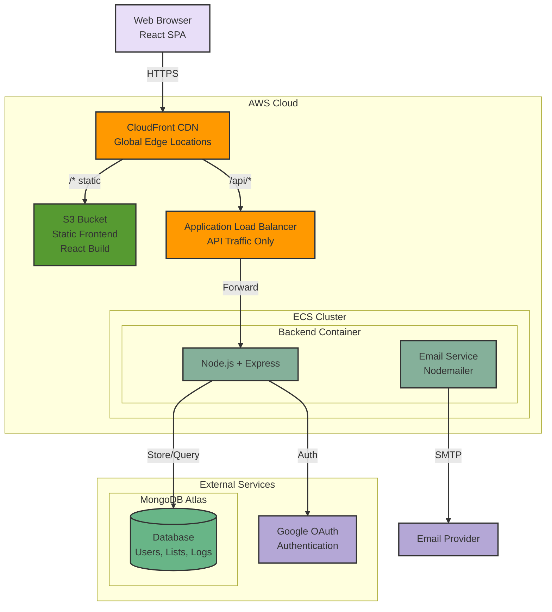

# 🎁 Gift Guru

A smart gift management platform that helps you create and share wishlists with friends and family.

🌐 **Check it out at [giftguru.cc](https://www.giftguru.cc)**

> **Note**: A google account is required to access the app. We don't require any sensitive or restricted scopes - we only use the public profile information to create a user account.

## ❓ What is this? Why?

Have you ever shared a wishlist with family and friends, perhaps as a google doc? And then everyone has to coordinate on who is buying what without spoiling the surprise?


This is a simple solution to that problem.


Born out of a need to make gift giving easier for my family after a particularly stressful gift giving season, this is a simple platform that allows you to create and share wishlists with friends and family.

## ✨ Features

- 📝 Create multiple gift lists
- ✏️ Add, edit, and remove items from your lists
- 📧 Share lists with others via email
- 👀 View lists shared with you
- 🎯 Claim items from shared lists
- 📊 Track when shared lists are viewed
- 🔄 Sort items by priority, price, or date added

## 🏗️ Architecture


```mermaid
graph TD
    %% Styling
    classDef browser fill:#E8DEF8,stroke:#333,stroke-width:2px
    classDef aws fill:#FF9900,stroke:#232F3E,stroke-width:2px,color:#232F3E
    classDef app fill:#85B09A,stroke:#333,stroke-width:2px
    classDef db fill:#68B587,stroke:#333,stroke-width:2px
    classDef external fill:#B4A7D6,stroke:#333,stroke-width:2px
    classDef storage fill:#569A31,stroke:#333,stroke-width:2px

    %% Client Layer
    Client[Web Browser<br/>React SPA]:::browser

    %% AWS Infrastructure
    subgraph AWS["AWS Cloud"]
        CF[CloudFront CDN<br/>Global Edge Locations]:::aws
        S3[S3 Bucket<br/>Static Frontend<br/>React Build]:::storage
        ALB[Application Load Balancer<br/>API Traffic Only]:::aws
        subgraph ECS["ECS Cluster"]
            subgraph BE["Backend Container"]
                Express[Node.js + Express]:::app
                EmailService[Email Service<br/>Nodemailer]:::app
            end
        end
    end

    %% External Services
    subgraph External["External Services"]
        subgraph Atlas["MongoDB Atlas"]
            MongoDB[(Database<br/>Users, Lists, Logs)]:::db
        end
        Google[Google OAuth<br/>Authentication]:::external
    end

    %% Connections
    Client --> |HTTPS| CF
    CF --> |/* static| S3
    CF --> |/api/*| ALB
    ALB --> |Forward| Express
    Express --> |Store/Query| MongoDB
    Express --> |Auth| Google
    EmailService --> |SMTP| SMTP[Email Provider]:::external

    %% Link Styling
    linkStyle default stroke:#333,stroke-width:2px;
```

## 🛠️ Tech Stack

- Infrastructure:
  - AWS CloudFront for global CDN and edge caching
  - AWS S3 for static frontend hosting
  - AWS ECS (Fargate) for backend container orchestration
  - Application Load Balancer for backend API traffic
  - Terraform for Infrastructure as Code
  - PowerShell deployment script
- Frontend: 
  - React with Material-UI
  - Deployed as static build to S3
  - Previously: Nginx container (retained for local development)
- Backend: 
  - Node.js with Express
  - Containerized with Docker on ECS Fargate
- Database: MongoDB Atlas (free tier)
- Authentication: Google OAuth 2.0

## 📚 Models

Our data model takes advantage of MongoDB's document-oriented structure to efficiently organize data with minimal collections:

- **User**
  - Core user data (email, name, picture)
  - Google OAuth integration via `googleId`
  - Support for pending user states

- **Wishlist**
  - Consolidated wishlist container and items
  - Embedded items array with full item details
  - Built-in sharing permissions via `sharedWith` array
  - Integrated item claiming system with user references
  - Properties per item:
    - Basic details (title, description, link)
    - Price and priority tracking
    - Claim status with timestamp

- **ActivityLog**
  - Comprehensive user activity tracking
  - Records all interactions (views, shares, claims)
  - References to related users and wishlists
  - Flexible `details` field for varied action types

This design eliminates the need for separate collections for items, shares, and views, reducing query complexity and improving performance.

## 💻 Development

### Local Development
1. Clone the repository
2. Set up environment variables (`.env.development`)
   - Set `DEV_AUTO_LOGIN=true` to skip Google OAuth setup
3. Run via Docker Compose:
   ```bash
   docker-compose up --build
   ```
   This runs frontend (Nginx), backend (Node.js), and MongoDB locally

4. (Optional) Seed the database with test data:
   ```bash
   cd backend && npm run seed
   ```

### Production Deployment

#### Initial Infrastructure Setup
1. Configure Terraform variables:
   ```bash
   cd terraform
   # Create terraform.tfvars with:
   # - ssl_certificate_arn
   # - cloudfront_secret (optional, for extra security)
   ```

2. Deploy infrastructure:
   ```bash
   terraform init
   terraform plan
   terraform apply
   ```

#### Backend & Frontend Deployment
Deployment runs in GitHub Actions. A push to `main` that touches `backend/` or `frontend/` triggers `.github/workflows/deploy.yml`, which only deploys the changed component (path-filtered):

- **Backend:** builds the Docker image, pushes to ECR, then `aws ecs update-service --force-new-deployment` against the backend service.
- **Frontend:** runs `npm ci && npm run build`, syncs to S3 with the standard cache headers, and invalidates the CloudFront distribution.

To trigger a manual deploy (or re-deploy without a code change), use **Actions → Deploy → Run workflow** and pick `both` / `backend` / `frontend`.

The workflow authenticates to AWS via OIDC against the IAM role provisioned in `terraform/github_oidc.tf`. After `terraform apply`, set these as repo Variables (Settings → Secrets and variables → Actions → Variables): `AWS_DEPLOY_ROLE_ARN`, `FRONTEND_S3_BUCKET`, `CLOUDFRONT_DISTRIBUTION_ID`.

**Manual DNS Update Required:**
After initial terraform apply, update your DNS (Route53 or external) to point `www.giftguru.cc` to the CloudFront distribution domain (available in terraform outputs).

### Environment Variables

**Backend (Production - AWS Parameter Store):**
- `MONGODB_URI` - MongoDB Atlas connection string
- `GOOGLE_CLIENT_ID` - OAuth client ID
- `GOOGLE_CLIENT_SECRET` - OAuth client secret
- `SESSION_SECRET` - Express session secret
- `GOOGLE_SA_USERNAME` - Email service account
- `GOOGLE_APP_PASSWORD` - Email app password
- `ADMIN_EMAILS` - Comma-separated admin emails

**Backend (Local - .env.development):**
Same as above, plus:
- `PORT` - Server port (default: 5000)
- `NODE_ENV` - Set to 'development'
- `FRONTEND_URL` - Frontend URL (http://localhost)
- `DEV_AUTO_LOGIN` - Set to 'true' to bypass Google OAuth (auto-login as seed user)
- `DEV_USER_EMAIL` - Email of user to auto-login as (default: hscopalm@gmail.com)

## 🔒 Security Considerations
- Development environment variables are managed through `.env.development`
- Production secrets are managed through AWS Systems Manager Parameter Store
- OAuth 2.0 for secure authentication
- HTTPS enforced via CloudFront and ALB
- MongoDB Atlas with IP whitelisting and authentication
- AWS security groups restrict ECS task access
- S3 bucket access limited to CloudFront via Origin Access Control (OAC)
- CloudFront uses custom header for ALB authentication (optional additional security)

## 📄 License
This project is licensed under the MIT License - see the [LICENSE](LICENSE) file for details.

## 🙏 Acknowledgments
- Material-UI for the component library
- MongoDB Atlas for database hosting
- AWS for infrastructure hosting
