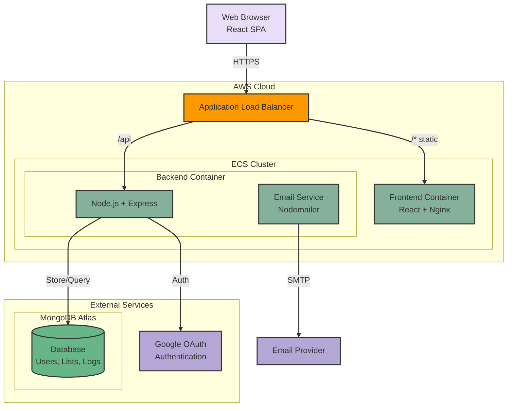

# 🎁 Gift Guru

A smart gift management platform that helps you create and share wishlists with friends and family.

## ❓ What is this? Why?

Have you ever shared a wishlist with family and friends, perhaps as a google doc? And then everyone has to coordinate on who is buying what? 

This is a simple solution to that problem.

Born out of a need to make gift giving easier for my family after a particularly stressful gift giving season, this is a simple platform that allows you to create and share wishlists with friends and family.

## ✨ Features

- 📝 Create multiple gift lists
- ✏️ Add, edit, and remove items from your lists
- 📧 Share lists with others via email
- 👀 View lists shared with you
- 🎯 Claim items from shared lists
- 📊 Track when shared lists are viewed
- 🔄 Sort items by priority, price, or date added

## 🏗️ Architecture

## 🛠️ Tech Stack

- Infrastructure:
  - AWS ECS for container orchestration
  - Application Load Balancer for traffic distribution
  - Terraform for Infrastructure as Code
  - CI/CD with GitHub Actions
- Frontend: 
  - React with Material-UI
  - Nginx for serving static content
  - Containerized with Docker
- Backend: 
  - Node.js with Express
  - Containerized with Docker
- Database: MongoDB with Mongoose
- Authentication: Google OAuth 2.0

## 📚 Models

Our data model takes advantage of MongoDB's document-oriented structure to efficiently organize data with minimal collections:

- **User**
  - Core user data (email, name, picture)
  - Google OAuth integration via `googleId`
  - Support for pending user states

- **Wishlist**
  - Consolidated wishlist container and items
  - Embedded items array with full item details
  - Built-in sharing permissions via `sharedWith` array
  - Integrated item claiming system with user references
  - Properties per item:
    - Basic details (title, description, link)
    - Price and priority tracking
    - Claim status with timestamp

- **ActivityLog**
  - Comprehensive user activity tracking
  - Records all interactions (views, shares, claims)
  - References to related users and wishlists
  - Flexible `details` field for varied action types

This design eliminates the need for separate collections for items, shares, and views, reducing query complexity and improving performance.

## 💻 Development

1. Clone the repository
2. Set up environment variables (`.env` or similar)
3. Build images
    a. For local development:
        - Build the images, and run the application via docker compose
    b. For deployment:
        - Build and deploy the images to AWS ECR via a deployment script
4. Deploy the infrastructure (if you are deploying to AWS)
    - Run `terraform init` and `terraform apply` to create the infrastructure

## 🔒 Security Considerations
- All secrets are managed through environment variables
- OAuth 2.0 for secure authentication
- HTTPS enforced in production
- MongoDB Atlas with IP whitelisting
- AWS security groups limit access to services

## 📄 License
This project is licensed under the MIT License - see the [LICENSE](LICENSE) file for details.

## 🙏 Acknowledgments
- Material-UI for the component library
- MongoDB Atlas for database hosting
- AWS for infrastructure hosting
